# Homelab

A bare-metal Kubernetes homelab built as an enterprise learning and experimentation platform. The goal is hands-on experience with production-grade cloud-native tooling - not at a "I followed a tutorial" level, but at a "I can reason about why each layer exists, what it catches, and what happens when things break" level.

## Architecture Decisions

| Document           | Covers                                                                          |
| ------------------ | ------------------------------------------------------------------------------- |
| [[lab - Compute]]  | node selection, RAM/CPU requirements, 3-node HA analysis, upgrade path          |
| [[lab - Storage]]  | Rook+Ceph architecture, Ceph as a learning tool, CloudNativePG, backup strategy |
| [[lab - Network]]  | VLAN segmentation, Cloudflare Tunnel, ProtonVPN, VPN access, threat model       |
| [[lab - Security]] | Falco, Kyverno, Trivy, 1Password+ESO, supply chain, blast radius analysis       |

## Hardware Summary

| Role           | Device                                                                                          | Cost        |
| -------------- | ----------------------------------------------------------------------------------------------- | ----------- |
| Compute (× 3)  | [Beelink SER9 Pro H255](https://www.amazon.com.au/dp/B0G4V467WH) — 8C/16T Zen 4, 32GB, dual M.2 | $2,384      |
| Ceph OSD (× 3) | 1TB NVMe (2nd M.2 slot)                                                                         | ~$390       |
| Router         | [Ubiquiti Cloud Gateway Ultra](https://www.amazon.com.au/gp/product/B0DMWVMMNC)                 | $198        |
| Switch         | [Ubiquiti USW Lite 8 PoE](https://www.amazon.com.au/gp/product/B0C6BPKXDF)                      | $199        |
| WiFi           | UniFi AP (U6+)                                                                                  | ~$175       |
| **Total**      |                                                                                                 | **~$3,346** |

## Stack Overview

```mermaid
flowchart TB
    subgraph platform [Platform]
        Talos[Talos Linux]
        Cilium[Cilium CNI]
        Flux[FluxCD]
        CM[cert-manager]
    end

    subgraph storage [Storage]
        Rook[Rook+Ceph\nRBD + RadosGW]
        CNPG[CloudNativePG]
        Volsync[Volsync\nPVC backup]
    end

    subgraph observability [Observability]
        Prom[Prometheus]
        Graf[Grafana]
        Loki[Loki]
        Gatus[Gatus]
        Hubble[Hubble\nCilium flows]
    end

    subgraph security [Security]
        Falco[Falco\nruntime detection]
        Kyverno[Kyverno\nadmission control]
        Trivy[Trivy\nimage scanning]
        PSS[Pod Security\nStandards]
    end

    subgraph identity [Identity and Secrets]
        KC[Keycloak]
        OP[1Password +\nExternal Secrets]
        SOPS[SOPS + age\nbootstrap only]
    end

    subgraph networking [Networking and Access]
        CF[Cloudflare Tunnel\n+ Access]
        EDNS[external-dns\npublic + private]
        PV[ProtonVPN\nrouter-level]
        WG[WireGuard VPN\nremote mgmt]
    end

    subgraph operations [Operations]
        ARC[ARC\nGH Actions runners]
        Renovate[Renovate\ndep updates]
        Spegel[Spegel\nOCI mirror]
    end

    Talos --> Cilium --> Flux
    Flux --> Rook & CNPG & Prom & Falco & KC & CF & ARC
    Rook --> CNPG
    Rook --> Volsync

    style platform fill:#e3f2fd,stroke:#2196f3
    style storage fill:#fce4ec,stroke:#e91e63
    style observability fill:#fff3e0,stroke:#ff9800
    style security fill:#e8f5e9,stroke:#4caf50
    style identity fill:#f3e5f5,stroke:#9c27b0
    style networking fill:#e0f2f1,stroke:#009688
    style operations fill:#fff8e1,stroke:#ffc107
```

## Network Layout

Four VLANs, default deny-all between them. Full details in [[lab - Network]].

| VLAN | Name | Devices                         | Internet via       |
| ---- | ---- | ------------------------------- | ------------------ |
| 10   | Home | phones, personal laptops (WiFi) | ProtonVPN          |
| 20   | Work | work laptop (WiFi)              | Direct (airgapped) |
| 30   | Mgmt | workstation (wired)             | ProtonVPN          |
| 40   | Lab  | SER9 Pro × 3 (wired)            | ProtonVPN          |

## Key Design Principles

**Reliability first..** 3-node HA — any single node can be pulled and the cluster stays online. etcd quorum holds at 2/3. Ceph data stays available (degraded, self-heals on node return). HA replicas for all critical services.

**GitOps everything..** Cluster state lives in Git. Flux reconciles. Renovate updates dependencies. Talos machineconfigs are declarative YAML. Security policies (Kyverno, Falco rules) are YAML in Git. Cloudflare Access policies are Terraform in Git. Nothing is configured via UI clicks that aren't version-controlled.

**Defence in depth..** Seven security layers from pre-deploy (Trivy, Renovate) through admission (Kyverno, PSS) to runtime (Falco, Cilium, RBAC) to infrastructure (Talos, VLANs). Each catches what the previous missed.

**Zero inbound exposure..** No port forwarding except WireGuard UDP 51820 (silent to probes). Public services via Cloudflare Tunnel (outbound connection). Home IP hidden from ISP (ProtonVPN) and public visitors (Cloudflare proxy).

**Learn by operating..** Ceph from day one - not because it's the easiest storage option, but because it teaches distributed systems fundamentals (crush, placement groups, replication vs erasure coding, recovery mechanics) that transfer to every large-scale storage system. Same philosophy applied to Cilium (eBPF networking), Talos (immutable infrastructure), and the security stack.

## Priorities (in order)

1. **Stability and uptime** — HA, N-1 survivability, PodDisruptionBudgets
2. **Observability** — Prometheus, Grafana, Loki, Hubble, Falco alerts
3. **GitOps and secrets** — Flux, Renovate, 1Password+ESO, SOPS bootstrap
4. **Networking and security** — VLAN segmentation, Cloudflare Tunnel, Cilium NetworkPolicy
5. **Storage** — Rook+Ceph, CloudNativePG, Volsync, R2 backups
6. **Workloads** — the actual apps (wiki, Kromgo, etc.)

## Public Endpoints

| Service                                                     | URL pattern          | Auth                                       |
| ----------------------------------------------------------- | -------------------- | ------------------------------------------ |
| [Kromgo](https://github.com/home-operations/kromgo) metrics | `status.domain.com`  | public (read-only)                         |
| Wiki                                                        | `wiki.domain.com`    | public read, Cloudflare Access for write   |
| Chat (LLM)                                                  | `chat.domain.com`    | Cloudflare Access (myself + trusted users) |
| Grafana                                                     | `grafana.domain.com` | Cloudflare Access (myself only)            |

## Upgrade Path

| Phase        | What                                              | Cost             |
| ------------ | ------------------------------------------------- | ---------------- |
| **Day one**  | 3 × SER9 Pro + networking gear                    | ~$3,046          |
| **Storage**  | 3 × 1TB NVMe OSD drives                           | ~$390            |
| **4th node** | Ceph self-healing, better HA spread               | ~$795            |
| **eGPU**     | USB4 dock + RTX 5070/5080 for local LLM inference | ~$150–250 (dock) |
| **Bastion**  | Raspberry Pi on VLAN 30 for credential isolation  | ~$100            |

## Reference

- On technology as a contemplative practice ([[2025-05-01]])
- [Talos Linux docs](https://www.talos.dev/)
- [Rook+Ceph docs](https://rook.io/docs/rook/latest/)
- [CloudNativePG docs](https://cloudnative-pg.io/documentation/)
- [Cilium docs](https://docs.cilium.io/)
- [FluxCD docs](https://fluxcd.io/flux/)
- [Falco docs](https://falco.org/docs/)
- [Kyverno docs](https://kyverno.io/docs/)
