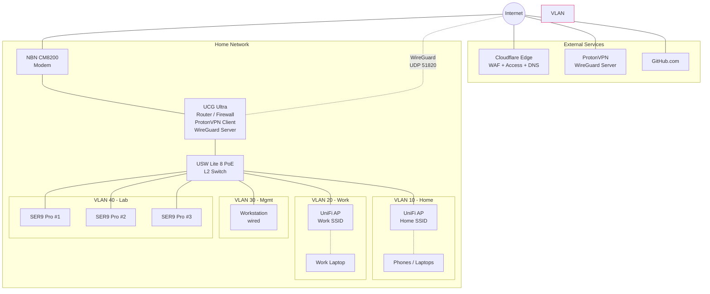
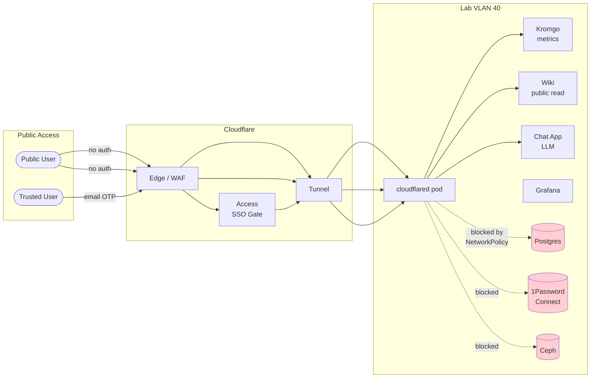
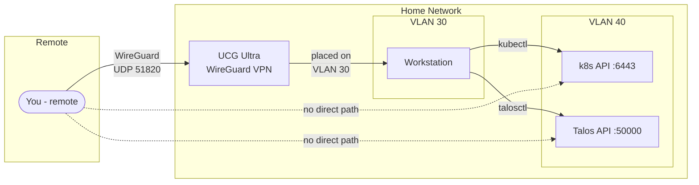

## Context

Network infrastructure for a 3-node bare-metal Kubernetes homelab. Structured as: threat model → decisions → implementation.

### Requirements

1. Public endpoints (metrics, wiki, apps) via Cloudflare Tunnel — no inbound ports, no home IP exposure
2. Full [network segmentation](https://www.paloaltonetworks.com/cybersecurity-perspectives/network-segmentation) between home, lab, management, and work devices
3. Work machine isolated — assume [EDR](https://www.crowdstrike.com/en-us/cybersecurity-101/endpoint-security/endpoint-detection-and-response-edr/), [DLP](https://www.ibm.com/topics/data-loss-prevention), and network traffic analysis are standard
4. Remote cluster management when away from wired workstation
5. Trusted user access to self-hosted apps without VPN or cluster credentials
6. Router-level [ProtonVPN](https://protonvpn.com/) — ISP sees only encrypted tunnel traffic
7. Self-hosted GitHub Actions runners — CI compute stays local
8. Cluster-internal blast radius containment — see [[lab - Security]]

## Threat Model

### Inbound

|Vector|Exposure|Mitigation|
|---|---|---|
|Open ports|**none** except WireGuard UDP 51820|[Cloudflare Tunnel](https://developers.cloudflare.com/cloudflare-one/networks/connectors/cloudflare-tunnel/) outbound only|
|Home IP discovery|**none**|Cloudflare proxy + ProtonVPN mask outbound|
|ISP traffic analysis|**mitigated**|ISP sees only encrypted WireGuard to ProtonVPN|
|WireGuard probe|silent|[cryptokey routing](https://www.wireguard.com/#cryptokey-routing) drops unknown peers|

### Lateral Movement (network-level)

|Compromised device|→ Lab?|→ Home?|→ Work?|→ Mgmt?|
|---|---|---|---|---|
|Phone/laptop (VLAN 10)|no|same VLAN|no|no|
|Work machine (VLAN 20)|no|no|[airgapped](https://www.cloudflare.com/learning/security/glossary/air-gap/)|no|
|Workstation (VLAN 30)|**yes — 6443, 50000**|no|no|—|
|Lab node (VLAN 40)|same VLAN|no|no|no|

For pod-level blast radius (RCE, container escape, sidecar access), see [[lab - Security]].

### Key Risks → Solutions

|Risk|Solution|
|---|---|
|Work device observing home/lab broadcast traffic|VLAN 20 — internet only|
|Workstation compromise → cluster access|wired-only VLAN 30, credentials encrypted at rest|
|ISP traffic analysis|ProtonVPN at router level|
|Trusted users need app access|Cloudflare Access — per-app, per-identity|
|ARC runners accessing cluster internals|dedicated namespace, deny-all NetworkPolicy — see [[lab - Security]]|

## Decisions

### 1. Remote Access: VPN (bastion deferred)

| |VPN only|VPN + [Bastion](https://goteleport.com/blog/ssh-bastion-host/)|
|---|---|---|
|Laptop stolen|VPN key + credentials → cluster compromised|VPN key only → must pivot through bastion|
|Friction|zero|SSH hop per session|
|Cost|$0|~$100 (Raspberry Pi)|

**Decision:** UCG Ultra's built-in [WireGuard](https://www.wireguard.com/). Places you on VLAN 30 with identical rules to wired workstation. No cluster dependency. Bastion as future learning exercise ([Google BeyondCorp](https://cloud.google.com/beyondcorp) pattern). [Tailscale](https://tailscale.com/) as NAT-traversal fallback.

### 2. Trusted User Access: Cloudflare Access (zero trust)

```
Trusted user (any device, anywhere) → app.your-domain.com
    → Cloudflare Access (email OTP / OAuth) → Tunnel → app pod
```

No VPN, no credentials, no VLAN access. Managed as code via [Cloudflare Terraform provider](https://registry.terraform.io/providers/cloudflare/cloudflare/latest/docs/resources/zero_trust_access_application).

### 3. ISP Privacy: ProtonVPN at Router Level

Per-VLAN policy routing on UCG Ultra:

|VLAN|Via ProtonVPN?|Why|
|---|---|---|
|Home (10)|**yes**|browsing privacy|
|Work (20)|**no**|corporate VPN conflict risk|
|Mgmt (30)|**yes**|workstation privacy|
|Lab (40)|**yes**|cluster traffic exits via VPN|

**Trust model:**

|Party|What they see|
|---|---|
|**ISP**|encrypted WireGuard only — no destinations, no DNS, no patterns|
|**ProtonVPN**|home IP + encrypted destinations (not content). [Swiss, audited no-logs.](https://protonvpn.com/blog/no-logs-audit/)|
|**Cloudflare**|ProtonVPN exit IP + public service content (TLS termination inherent to CDN)|

### 4. Public Endpoints: Tunnel + Access

```
Internet → Cloudflare Edge (TLS/WAF/DDoS) → Access (identity gate)
    → Tunnel (outbound from cluster via ProtonVPN) → Cilium → service
```

|Service|Public?|Auth|Who|
|---|---|---|---|
|[Kromgo](https://github.com/home-operations/kromgo) metrics|**yes**|none (read-only)|anyone|
|Wiki ([Wiki.js](https://js.wiki/) / [Outline](https://www.getoutline.com/))|**public read**|write: Cloudflare Access|anyone reads, you edit|
|Chat app (LLM)|yes|Cloudflare Access|you + trusted users|
|Grafana|yes|Cloudflare Access|you only|
|k8s API / Talos API / Ceph|**never**|mTLS, VLAN 30 only|—|

Tunnel pod isolation via Cilium NetworkPolicy — see [[lab - Security]].

### 5. DNS: Dual ExternalDNS

Following the [onedr0p/home-ops](https://github.com/onedr0p/home-ops) pattern — two [external-dns](https://github.com/kubernetes-sigs/external-dns) instances:

|Instance|Ingress class|Target|Purpose|
|---|---|---|---|
|external-dns (public)|`external`|Cloudflare DNS|public records (`app.your-domain.com` → Cloudflare Tunnel)|
|external-dns (private)|`internal`|UCG Ultra (UniFi webhook)|private records (`grafana.lab.your-domain.com` → Cilium L2 IP)|

Private DNS means services on Lab VLAN get proper names resolvable from the workstation (VLAN 30) without editing `/etc/hosts` or remembering IPs.

|Layer|Resolver|
|---|---|
|Cluster-internal|CoreDNS|
|VPN-wrapped VLANs|ProtonVPN tunnel DNS (prevents [DNS leaks](https://protonvpn.com/support/dns-leaks/))|
|Work VLAN|ISP/corporate DNS|
|Private (lab services)|UCG Ultra via external-dns UniFi webhook|
|Public|Cloudflare DNS via external-dns|

### 6. ARC Runners: Ephemeral, Isolated

[Actions Runner Controller](https://github.com/actions/actions-runner-controller) in a dedicated namespace. Security details in [[lab - Security]].

|Concern|Mitigation|
|---|---|
|Runner accesses cluster services|deny-all NetworkPolicy, internet-only egress|
|State leaks between jobs|ephemeral — fresh pod per job, destroyed after|
|GitHub sees runner IP|exits via ProtonVPN|
|Repo hosting|code on GitHub, CI runs locally|

## Implementation

### Hardware

|Role|Device|Price|Link|
|---|---|---|---|
|Modem|NBN CM8200 (HFC)|provided|[Guide](https://www.nbnco.com.au/content/dam/nbnco2/documents/1730118_HFC_Setup_Guide_180x130mm_PAY%20TV_1.0_ONLINE.pdf)|
|Router|Ubiquiti Cloud Gateway Ultra|$198|[Amazon AU](https://www.amazon.com.au/gp/product/B0DMWVMMNC)|
|Switch|Ubiquiti USW Lite 8 PoE|$199|[Amazon AU](https://www.amazon.com.au/gp/product/B0C6BPKXDF)|
|WiFi AP|UniFi AP (U6+)|~$150–200|VLAN-tagged SSIDs|

### Port Allocation

|Port|Device|VLAN|
|---|---|---|
|1|UCG Ultra uplink|trunk|
|2–4|SER9 Pro nodes × 3|Lab (40)|
|5|Workstation (wired)|Mgmt (30)|
|6|UniFi AP|trunk|
|7|spare (future 4th node)|Lab (40)|
|8|spare|—|

Work machine on WiFi (Work SSID → VLAN 20). 1GbE switch, 2.5GbE nodes auto-negotiate down.

### VLAN Layout

|VLAN|Name|Devices|Transport|Internet via|
|---|---|---|---|---|
|10|Home|Phones, laptops|WiFi (Home SSID)|ProtonVPN|
|20|Work|Work laptop|WiFi (Work SSID)|direct|
|30|Mgmt|Workstation|wired|ProtonVPN|
|40|Lab|SER9 Pro × 3|wired|ProtonVPN|

### Firewall Rules

Default: **deny all inter-VLAN.** Explicit allows only:

|Source → Dest|Ports|Why|
|---|---|---|
|Mgmt (30) → Lab (40)|6443, 50000|kubectl, talosctl|
|Lab (40) → Internet|443, 53, 123|pulls, Tunnel, Flux, NTP|
|All → Internet|443, 80, 53|general internet|
|**All other inter-VLAN**|**deny**|—|

### Cilium

|Function|Role|
|---|---|
|CNI|pod networking, IPAM|
|NetworkPolicy|per-app egress/ingress — details in [[lab - Security]]|
|L2 announcements|LoadBalancer IPs on Lab VLAN (replaces MetalLB)|
|[Hubble](https://docs.cilium.io/en/stable/observability/hubble/)|flow logs, drops, latency → Grafana|

### Istio — Skipped

onedr0p uses Istio for L7 service mesh (mTLS between services, traffic management). Cilium already provides L7 observability via Hubble and has its own service mesh capabilities. Adding Istio alongside Cilium is significant complexity for marginal benefit at homelab scale. If service mesh becomes a learning goal later, Cilium's built-in mesh or Linkerd are lighter alternatives.

## Diagrams

### Network Topology



### Traffic Flows



### VPN & Management Access



## Consequences

- Four VLANs with default deny-all. Work machine airgapped via WiFi SSID. Lab unreachable from Home or Work.
- ProtonVPN wraps Home, Mgmt, and Lab. ISP sees encrypted WireGuard only. Work exits direct.
- Cloudflare Access gates trusted user access per-app — managed as Terraform in Git.
- Dual ExternalDNS gives proper DNS names for both public (Cloudflare) and private (UCG Ultra) services.
- Istio skipped — Cilium covers L7 observability and can add service mesh later if needed.
- ARC runners ephemeral, namespace-isolated, internet-only egress.
- Home IP hidden from ISP (ProtonVPN), public visitors (Cloudflare), and GitHub (runners via ProtonVPN).
