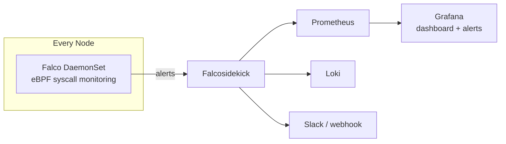
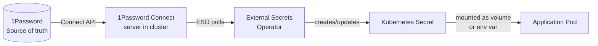
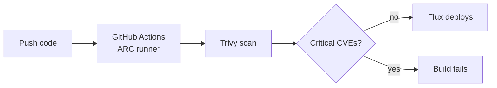
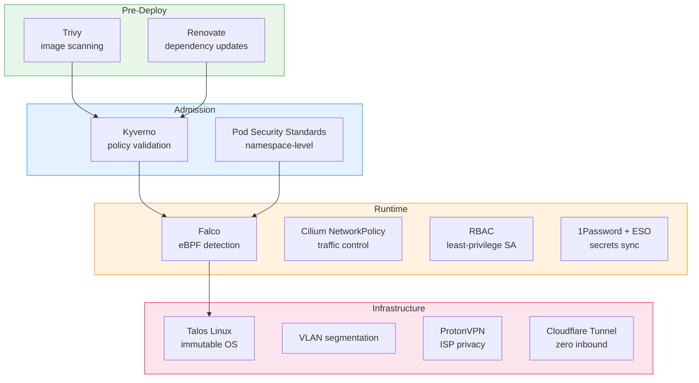

## Context

Security posture for a 3-node bare-metal Kubernetes homelab running Talos Linux. The goal is a credible, layered security stack that demonstrates understanding of cloud-native security primitives at a **senior platform engineer** level.

The positioning: "I can explain what each layer does, why it's there, and what it catches. I'm not the person writing custom Falco rules or building CVE detection pipelines — I'm the person who ensures the platform has the right controls in place and can reason about blast radius when something goes wrong."

Network-level security (VLAN segmentation, Cloudflare Tunnel, ProtonVPN, firewalling) is covered in [[lab - Network]]. This document covers cluster-internal security.

## Threat Model

What happens after an attacker gets past the network boundary.

|Threat|Example|Layer that catches it|
|---|---|---|
|Malicious container behaviour|shell spawned, unexpected outbound connection, crypto miner|**Falco**|
|Bad pod spec deployed|privileged container, host network, root user|**Kyverno** + **Pod Security Standards**|
|Compromised dependency|malicious package in base image, known CVE|**Trivy** + **Renovate**|
|Secret exposure|hardcoded credentials, leaked ServiceAccount tokens|**1Password + ESO** + **RBAC**|
|Lateral movement|compromised pod reaches Postgres, Vault, or Ceph|**Cilium NetworkPolicy** (see [[homelab-networking]])|
|Privilege escalation|container escape, kernel exploit|**Talos** (immutable) + **Falco** (detection)|

## Decisions

### 1. Runtime Detection: [Falco](https://falco.org/)

[CNCF graduated](https://www.cncf.io/projects/falco/) runtime security tool. Monitors kernel syscalls via [eBPF](https://ebpf.io/), alerts on anomalous behaviour. DaemonSet on every node.

**Why Falco over [Tetragon](https://tetragon.io/):** Tetragon (Cilium project) can both detect and enforce — technically stronger. But Falco has broader industry recognition. "I run Falco" lands instantly in interviews. Tetragon is probably well-known (at least from what I've seen on Reddit and in the CNCF space), but in Australia it's likely going to get a "what's that?" from a fair chunk of the room. Falco is the safe, credible pick.

**How it fits:**



- [Modern eBPF driver](https://falco.org/docs/event-sources/kernel/) — works on Talos without kernel modules
- [Falcosidekick](https://github.com/falcosecurity/falcosidekick) routes alerts to existing observability stack
- Default rules cover: shell in container, unexpected network connections, privilege escalation, sensitive file reads, binaries from `/tmp`
- Start with defaults, tune false positives as they appear
- ~128–256 MB RAM per node

**Interview story:** "Falco runs as a DaemonSet on every node, monitors syscalls via eBPF, and alerts when something unexpected happens — like a shell spawning in a production container or an outbound connection to an unknown IP. Alerts go to Grafana and Slack via Falco-sidekick. I mostly run the default rule set and tune out false positives."

### 2. Admission Control: [Kyverno](https://kyverno.io/)

[CNCF graduated](https://www.cncf.io/projects/kyverno/) policy engine. Validates and rejects bad pod specs before they run.

**Kyverno vs Flux vs Kustomize — completely unrelated tools:**

```
You write a Deployment YAML
    → Kustomize patches it (overlays, env-specific config)
        → Flux deploys it (GitOps reconciliation from Git)
            → Kyverno validates it (admission webhook at the API server)
                → Accepted or rejected
```

Kyverno never sees your Git repo or Kustomize overlays. It only sees the final resource as it hits the Kubernetes API. If Flux tries to apply a privileged pod, Kyverno rejects it — Flux reports the failure. They're complementary, not overlapping.

**Why Kyverno over [OPA Gatekeeper](https://open-policy-agent.github.io/gatekeeper/):** Kyverno policies are plain YAML. Gatekeeper requires [Rego](https://www.openpolicyagent.org/docs/latest/policy-language/) (a dedicated policy language). For a platform engineer who isn't specialising in policy, YAML policies are readable and reviewable without learning a new language. Both are CNCF graduated — Kyverno is the pragmatic choice.

**Key policies:**

|Policy|Enforces|
|---|---|
|Disallow privileged containers|no `privileged: true`|
|Require non-root|`runAsNonRoot: true`|
|Require read-only root filesystem|`readOnlyRootFilesystem: true`|
|Disallow host namespaces|no `hostNetwork`, `hostPID`, `hostIPC`|
|Require resource limits|CPU/memory limits on every pod|
|Restrict image registries|only allowed registries|

Policies in Git, deployed via Flux. Bad specs rejected before they ever run.

**Interview story:** "Kyverno validates pod specs at admission time. If someone tries to deploy a privileged container or a pod without resource limits, it's rejected before it runs. Policies are YAML in Git, deployed by Flux. It catches things before Falco ever needs to."

### 3. Pod Security: [Pod Security Standards](https://kubernetes.io/docs/concepts/security/pod-security-standards/) (built-in)

Kubernetes-native, no additional tool. Applied at namespace level via labels.

|Profile|Where|
|---|---|
|**Restricted**|all workload namespaces — non-root, read-only FS, no escalation|
|Baseline|system namespaces needing relaxed rules (Ceph, Falco DaemonSets)|
|Privileged|`kube-system` only|

Kyverno and PSS overlap intentionally — [defence in depth](https://www.ibm.com/topics/defense-in-depth). PSS is the cluster-wide baseline. Kyverno adds finer-grained policies and better rejection messages.

### 4. Secrets Management: [1Password](https://1password.com/) + [External Secrets Operator](https://external-secrets.io/)

Secrets live in 1Password (already used personally). [1Password Connect](https://developer.1password.com/docs/connect/) runs in the cluster, ESO syncs secrets to Kubernetes.



|Principle|How|
|---|---|
|Secrets not stored as plaintext in Git|1Password is source of truth, ESO syncs to k8s|
|Apps don't talk to 1Password|ESO handles integration — apps read standard k8s Secrets|
|Least privilege|each app's ESO SecretStore scoped to its own 1Password vault/item|
|Rotation|update in 1Password → ESO syncs automatically|
|Bootstrapping|1Password Connect credentials are the only bootstrap secret — stored as a [SOPS](https://github.com/getsops/sops)-encrypted file in Git, decrypted by Flux at apply time|

**Bootstrapping the bootstrap:** the chicken-and-egg problem. 1Password Connect needs credentials to reach 1Password. Those credentials are SOPS-encrypted with [age](https://github.com/FiloSottile/age) in the Git repo. Flux has native SOPS decryption support. The age private key lives on your workstation (backed up offline). This is a single encrypted file — everything else flows from 1Password via ESO.

This is the same pattern as [onedr0p/home-ops](https://github.com/onedr0p/home-ops), which uses 1Password Connect + ESO for all secret management.

**Why not HashiCorp Vault:** Vault is operationally heavy (unsealing, HA, backup, policies) and would be a fifth steep learning curve alongside Talos, Flux, Cilium, and Ceph. 1Password is already in use, requires near-zero operational overhead, and still teaches the ESO pattern that transfers directly to Vault-backed ESO setups in production. If Vault knowledge becomes specifically needed later, it can replace 1Password Connect as the ESO backend — the ESO layer and all app integrations stay identical, only the SecretStore backend changes.

**Interview story:** "Secrets live in 1Password. External Secrets Operator syncs them into Kubernetes Secrets automatically. Apps never know where secrets come from — they just read standard k8s Secrets. The bootstrap credentials for 1Password Connect are the only thing encrypted in Git, via SOPS with age. Everything else flows from 1Password."

### 5. Image Scanning: [Trivy](https://trivy.dev/)

[CNCF graduated](https://www.cncf.io/projects/trivy/) vulnerability scanner. Runs in CI via ARC (self-hosted GitHub Actions runners in the cluster).



- Scans container images for known CVEs during CI
- Blocks builds with critical/high vulnerabilities
- Can also scan manifests and Helm charts for misconfigurations
- Complements Kyverno's image registry restriction — Trivy checks what's in the image, Kyverno checks where it came from

### 6. Supply Chain: [Renovate](https://docs.renovatebot.com/) + [Flux](https://fluxcd.io/)

Already part of the platform stack. Security perspective:

|Function|Tool|Security benefit|
|---|---|---|
|Dependency updates|Renovate|automated PRs for outdated images, Helm charts, Talos — CVEs patched faster|
|GitOps reconciliation|Flux|cluster matches Git — no drift, auditable history|
|Audit trail|GitHub|every change is a PR with review and timestamp|

Optional future: [Spegel](https://github.com/spegel-org/spegel) as cluster-local OCI mirror — reduces pulls from public registries, lowers supply chain exposure. Same as onedr0p/home-ops.

## Security Layer Summary



Each layer catches what the previous missed:

- **Renovate** patches known CVEs before they reach the cluster
- **Trivy** catches CVEs Renovate hasn't addressed yet
- **Kyverno + PSS** reject bad pod specs before they run
- **Falco** detects anomalous behaviour that passed all checks
- **Cilium** limits blast radius of anything malicious running
- **RBAC + 1Password/ESO** limits what a compromised pod can access
- **Talos + VLANs** limits what a compromised node can reach

## Consequences

- Seven layers, one tool per layer, all open source or already-subscribed services. No new cloud dependencies beyond 1Password (already in use).
- Falco is detect-only. If in-kernel enforcement is ever needed, Tetragon can be added alongside without replacing Falco.
- Kyverno policies and Falco rules are YAML in Git, deployed by Flux. Security config is auditable and version-controlled.
- 1Password + ESO is operationally simple compared to self-hosted Vault. If Vault is needed later, only the ESO SecretStore backend changes — all app integrations stay identical.
- SOPS + age encrypts only the 1Password Connect bootstrap credentials in Git. Single encrypted file, single age key (backed up offline). Everything else flows from 1Password.
- Trivy in CI adds ~30–60s per build. Acceptable for catching CVEs before deployment.
- Total RAM overhead: Falco (~128–256 MB/node × 3) + Kyverno (~256 MB) + 1Password Connect (~128 MB) + ESO (~128 MB) ≈ **~1.2–1.5 GB across cluster.**
