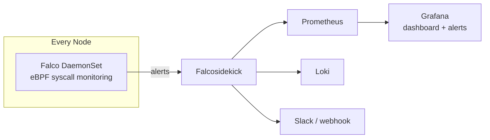
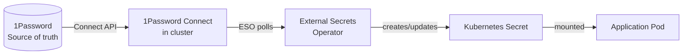
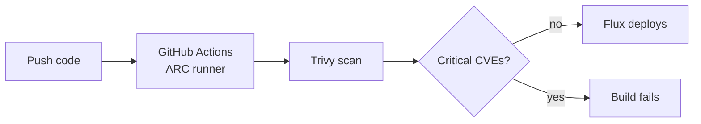
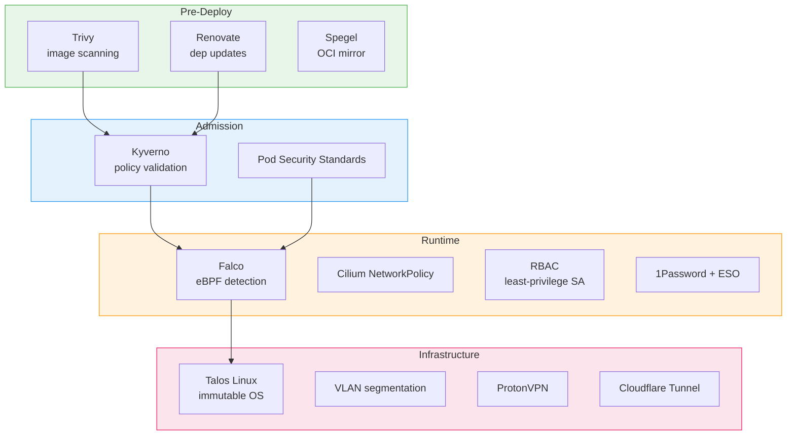

## Context

Security posture for a 3-node bare-metal Kubernetes homelab running Talos Linux. The goal is a credible, layered security stack that demonstrates understanding of cloud-native security primitives at a **senior/staff platform engineer** level.

The positioning: "I can explain what each layer does, why it's there, and what it catches. I'm not the person writing custom Falco rules or building CVE detection pipelines — I'm the person who ensures the platform has the right controls in place and can reason about blast radius when something goes wrong."

Network-level security (VLAN segmentation, Cloudflare Tunnel, ProtonVPN, firewalling) is covered in [[lab - Network]]]. This document covers cluster-internal security.

## Threat Model

What happens after an attacker gets past the network boundary.

|Threat|Example| Layer that catches it                            |
| ----------------------------- | ----------------------------------------------------------- | ------------------------------------------------ |
|Malicious container behaviour|shell spawned, unexpected outbound connection, crypto miner| **Falco**                                        |
|Bad pod spec deployed|privileged container, host network, root user| **Kyverno** + **Pod Security Standards**         |
|Compromised dependency|malicious package in base image, known CVE| **Trivy** + **Renovate**                         |
|Secret exposure|hardcoded credentials, leaked ServiceAccount tokens| **1Password + ESO** + **RBAC**                   |
|Lateral movement|compromised pod reaches Postgres or Ceph| **Cilium NetworkPolicy** (see [[lab - Network]]) |
|Privilege escalation|container escape, kernel exploit| **Talos** (immutable) + **Falco** (detection)    |

### Blast Radius: Compromised Public App

Worst-case chain: trusted user's device compromised → attacker uses Cloudflare Access session → [RCE](https://www.cloudflare.com/learning/security/what-is-remote-code-execution/) in self-hosted app → attempts lateral movement.

| Stage                                                                                   | Containment                                                                                                                                      |
| --------------------------------------------------------------------------------------- | ------------------------------------------------------------------------------------------------------------------------------------------------ |
| Uses Cloudflare session                                                                 | Session expiry (configurable). Revoke email → instant lockout.                                                                                   |
| RCE inside container                                                                    | Non-root, read-only FS, no privilege escalation ([Pod Security Standards](https://kubernetes.io/docs/concepts/security/pod-security-standards/)) |
| Reaches other services                                                                  | **Cilium NetworkPolicy** — app can only reach its own DB + internet                                                                              |
| Reads ServiceAccount token                                                              | **[RBAC](https://kubernetes.io/docs/reference/access-authn-authz/rbac/)** — zero permissions                                                     |
| Accesses sidecars                                                                       | ESO sidecar scoped to app's own secrets only                                                                                                     |
| [Container escape](https://www.redhat.com/en/topics/security/container-security) → node | Talos is [immutable](https://www.redhat.com/en/topics/linux/what-is-an-immutable-linux) — no shell, no SSH, read-only FS                         |
| Node → other VLANs                                                                      | VLAN firewall: Lab → everything else denied (see [[lab - Network]])                                                                              |

**True worst case (two chained exploits):** attacker on a Talos node with no shell. Could theoretically read kubelet's local pod secrets for that node. Cannot reach other nodes, other VLANs, or the internet beyond Lab's allowed ports.

## Decisions

### 1. Runtime Detection: [Falco](https://falco.org/)

[CNCF graduated](https://www.cncf.io/projects/falco/) runtime security. Monitors kernel syscalls via [eBPF](https://ebpf.io/). DaemonSet on every node.

**Why Falco over [Tetragon](https://tetragon.io/):** Tetragon (Cilium project) can both detect and enforce — technically stronger. But Falco has broader industry recognition. "I run Falco" lands instantly in interviews. Tetragon is probably well-known (at least from what I've seen on Reddit and in the CNCF space), but in Australia it's likely going to get a "what's that?" from a fair chunk of the room. Falco is the safe, credible pick.



- [Modern eBPF driver](https://falco.org/docs/event-sources/kernel/) — works on Talos without kernel modules
- Default rules: shell in container, unexpected network, privilege escalation, sensitive file reads, binaries from `/tmp`
- ~128–256 MB RAM per node

**Interview story:** "Falco runs as a DaemonSet on every node, monitors syscalls via eBPF, and alerts when something unexpected happens — like a shell spawning in a production container or an outbound connection to an unknown IP. Alerts go to Grafana and Slack via Falcosidekick."

### 2. Admission Control: [Kyverno](https://kyverno.io/)

[CNCF graduated](https://www.cncf.io/projects/kyverno/) policy engine. Validates and rejects bad pod specs at admission time.

**How Kyverno relates to Flux and Kustomize — they're completely separate tools:**

```
You write YAML → Kustomize patches it → Flux deploys it → Kyverno validates at the API server
```

Kyverno never sees Git or Kustomize overlays. It only sees the final resource hitting the k8s API. If Flux tries to apply a privileged pod, Kyverno rejects it and Flux reports the failure.

**Why Kyverno over [OPA Gatekeeper](https://open-policy-agent.github.io/gatekeeper/):** Kyverno policies are plain YAML. Gatekeeper needs [Rego](https://www.openpolicyagent.org/docs/latest/policy-language/). For a platform engineer, YAML policies are readable without learning a new language.

**Key policies:** disallow privileged containers, require non-root, require read-only root FS, disallow host namespaces, require resource limits, restrict image registries, require standard labels.

**Interview story:** "Kyverno validates pod specs at admission time. If someone tries to deploy a privileged container or a pod without resource limits, it's rejected before it runs. Policies are YAML in Git, deployed by Flux."

### 3. Pod Security: [Pod Security Standards](https://kubernetes.io/docs/concepts/security/pod-security-standards/) (built-in)

|Profile|Where|
|---|---|
|**Restricted**|all workload namespaces|
|Baseline|system namespaces (Ceph, Falco DaemonSets)|
|Privileged|`kube-system` only|

PSS and Kyverno overlap intentionally — [defence in depth](https://www.ibm.com/topics/defense-in-depth).

### 4. Secrets Management: [1Password](https://1password.com/) + [External Secrets Operator](https://external-secrets.io/)

Secrets live in 1Password (already used personally). [1Password Connect](https://developer.1password.com/docs/connect/) runs in the cluster, ESO syncs to Kubernetes.



|Principle|How|
|---|---|
|Secrets not stored as plaintext in Git|1Password is source of truth|
|Apps don't talk to 1Password|ESO handles integration|
|Least privilege|each app's SecretStore scoped to its own 1Password vault/item|
|Rotation|update in 1Password → ESO syncs automatically|
|Bootstrapping|1Password Connect credentials are the only bootstrap secret — [SOPS](https://github.com/getsops/sops)-encrypted with [age](https://github.com/FiloSottile/age) in Git, decrypted by Flux|

Same pattern as [onedr0p/home-ops](https://github.com/onedr0p/home-ops).

**Interview story:** "Secrets live in 1Password. ESO syncs them into k8s Secrets automatically. The only thing encrypted in Git is the 1Password Connect bootstrap credential, via SOPS with age."

### 5. Image Scanning: [Trivy](https://trivy.dev/)

[CNCF graduated](https://www.cncf.io/projects/trivy/) scanner. Runs in CI via ARC runners.



Complements Kyverno: Trivy checks what's in the image, Kyverno checks where it came from.

### 6. Supply Chain: [Renovate](https://docs.renovatebot.com/) + [Flux](https://fluxcd.io/) + [Spegel](https://github.com/spegel-org/spegel)

|Tool|Security role|
|---|---|
|Renovate|automated PRs for outdated images, Helm charts, Talos — CVEs patched faster|
|Flux|cluster matches Git — no drift, auditable history|
|Spegel|cluster-local OCI mirror — reduces external pulls, improves reliability, lowers supply chain exposure|

### 7. Tunnel + Runner Isolation (Cilium NetworkPolicy)

Cloudflare Tunnel pod and ARC runner pods are restricted to only their required egress:

```yaml
# cloudflared: only reaches explicitly listed services
apiVersion: cilium.io/v2
kind: CiliumNetworkPolicy
metadata:
  name: cloudflared-egress
spec:
  endpointSelector:
    matchLabels:
      app: cloudflared
  egress:
    - toEndpoints:
        - matchLabels:
            app: kromgo
        - matchLabels:
            app: grafana
        - matchLabels:
            app: wiki
        - matchLabels:
            app: chat-llm
```

ARC runners: deny-all except internet egress (pull deps, report to GitHub).

## Security Layer Summary



Each layer catches what the previous missed. Renovate patches CVEs → Trivy catches remaining → Kyverno rejects bad specs → Falco detects anomalies → Cilium limits blast radius → RBAC limits access → Talos + VLANs limit node-level damage.

## Consequences

- Seven layers, one tool per layer, all open source or already-subscribed services. No new cloud dependencies beyond 1Password.
- Falco is detect-only. Tetragon can be added alongside if enforcement is needed later.
- Kyverno policies and Falco rules are YAML in Git, deployed by Flux.
- 1Password + ESO avoids Vault operational overhead. If Vault is ever needed, only the ESO SecretStore backend changes — all app integrations stay identical.
- SOPS + age encrypts only the bootstrap credential. Single file, single key (backed up offline).
- Spegel reduces supply chain exposure by mirroring images cluster-locally.
- Total RAM: Falco (~128–256 MB/node × 3) + Kyverno (~256 MB) + 1Password Connect (~128 MB) + ESO (~128 MB) + Spegel (~128 MB) ≈ **~1.5–2 GB across cluster.**
